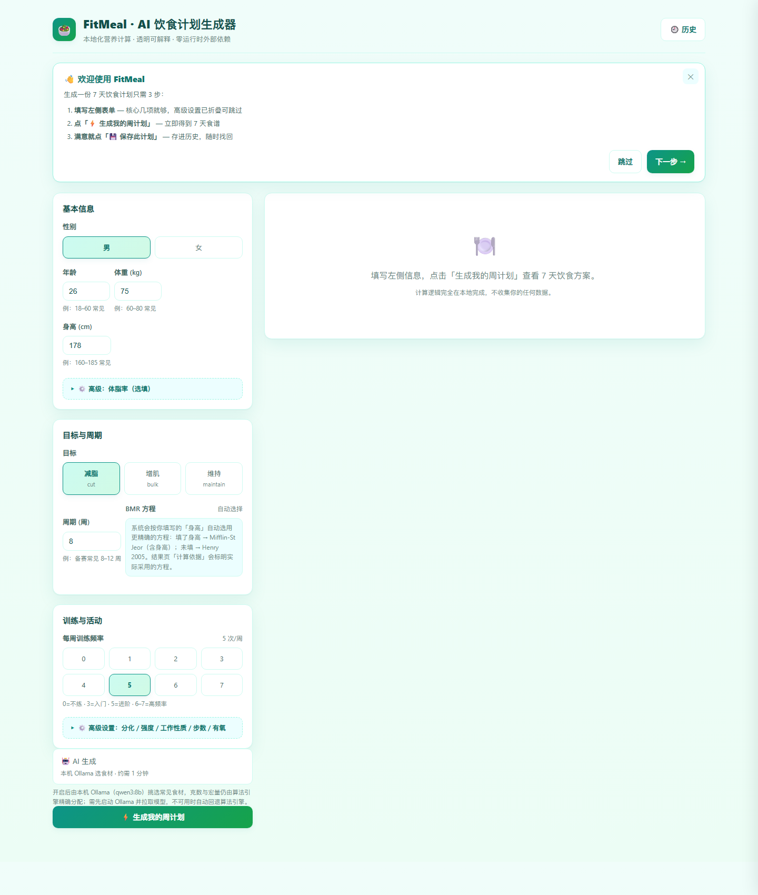
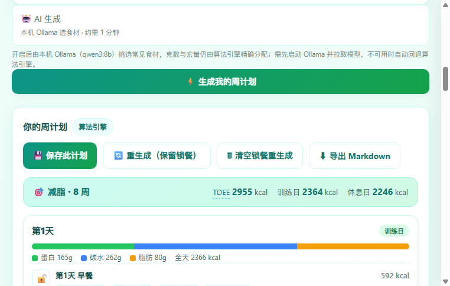

# FitMeal · AI 饮食计划生成器

> 面向进阶 / 备赛健身人群的中文周饮食计划生成器 —— 本地营养计算引擎 + 可选本机 LLM，透明可解释，零运行时外部依赖。


---

## 目录

- [核心特性](#核心特性)
- [界面预览](#界面预览)
- [快速开始](#快速开始)
- [功能详解](#功能详解)
  - [营养计算引擎](#营养计算引擎)
  - [周计划生成器](#周计划生成器)
  - [AI 模式（受控选材）](#ai-模式受控选材)
  - [结果页：锁餐与重生成](#结果页锁餐与重生成)
  - [历史记录与导出](#历史记录与导出)
- [计算模型一览](#计算模型一览)
- [技术栈与设计约束](#技术栈与设计约束)
- [项目结构](#项目结构)
- [测试](#测试)
- [文档一览](#文档一览)
- [FAQ](#faq)
- [免责声明](#免责声明)
- [许可](#许可)

## 核心特性

- **本地计算，数字透明** —— BMR / PAL / TDEE / 宏量分配全部由本地纯函数引擎完成，结果页可展开「计算依据」查看每一步公式与代入值，不调用任何第三方营养 API。
- **数字 100% 达标的保证机制** —— 每餐分量由定点迭代算法收敛到当日热量与蛋白目标，食材天然蛋白的干扰（如主食蛋白挤占主蛋白）有专门兜底逻辑，最终全天宏量必然对上目标。
- **AI 模式 = 受控选材** —— 可选接入本机 Ollama（qwen3:8b）或云端 LLM，LLM 只负责「每餐选什么食材」（仅输出库内食材 id），分量仍由算法分配；LLM 幻觉被隔离在选材层，输出非法即整体回退。
- **训练日 / 休息日碳循环** —— 训练日高碳促合成、休息日低碳控热量，支持减脂 / 增肌 / 维持三目标与 1–52 周周期，减脂目标附备赛充碳周（peak week）提示。
- **锁餐重生成** —— 对满意的一餐一键上锁，重生成只替换未锁餐次；算法模式通过可注入 seed 实现确定性随机化（同 seed 同结果，重生成换新 seed）。
- **历史与导出** —— 手动保存计划快照（最多 20 条），随时打开 / 删除 / 导出为与页面一致的 Markdown 文档；数据仅存于浏览器 localStorage。

## 界面预览

**首页**：核心几项即可生成，高级字段折叠收纳，首次访问有 3 步引导。



**结果页**：一句话结论（目标 + TDEE + 训练日 / 休息日热量）置顶，7 天卡片带宏量占比条与逐餐克数，可展开完整计算依据。



## 快速开始

环境要求：Node.js ≥ 18.17。

```bash
git clone https://github.com/panyuch/ai_fitness_planner.git
cd ai_fitness_planner
npm install
npm run dev
```

打开 http://localhost:3000 ，填写左侧表单，点击「生成我的周计划」即可。不需要任何 API Key、数据库或账号。

可选：启用 AI 模式前，在本机安装并启动 [Ollama](https://ollama.com)，拉取模型 `ollama pull qwen3:8b`，然后在表单区打开「AI 生成」开关。

## 功能详解

### 营养计算引擎

`lib/nutrition.js`，纯函数、零依赖、可在 Node 与浏览器端运行。

| 步骤 | 公式 / 规则 |
| --- | --- |
| BMR | 填了身高自动用 Mifflin-St Jeor（含身高），未填则用 Henry 2005（仅体重）；可显式覆盖 |
| PAL | 训练频率基准（1.2–1.725）+ 工作性质 + 有氧次数 + 日均步数（NEAT）+ 训练强度，钳制 [1.2, 1.9] |
| TDEE | BMR × PAL |
| 阶段热量 | 减脂 −15%～−20% / 增肌 +10%～+12%（按周期是否 ≤8 周取档）；减脂目标休息日再 ×95% 放大碳循环 |
| 蛋白 | 减脂 2.2 g/kg、增肌 2.0、维持 1.8；设可行性上限（蛋白热量 ≤ TDEE 的 40%） |
| 碳水 / 脂肪 | 按目标与日型的占比表分配，碳水作为剩余项补足 |

### 周计划生成器

`lib/generator.js`，输入身体数据与目标，输出 7 天 × 4 餐（早餐 / 午餐 / 晚餐 / 加餐）的完整食谱。

- **排程**：按每周训练频率映射到固定的训练日分布表，保证训练日穿插休息日。
- **选材**：从本地食材库（`lib/foods.js`，29 种，数据取自中国食物成分表第 6 版与 USDA FoodData Central）的蛋白 / 碳水 / 蔬菜 / 脂肪 / 水果 / 乳制品六个池中轮换选取；主食槽位仅用低蛋白主食（米饭 / 土豆 / 红薯等），避免高蛋白主食在大份量下挤占主蛋白。
- **定克数**：每餐按餐次占比拆分当日目标，定点迭代 4 轮收敛；「天然蛋白逼近目标」「小餐放不下蔬菜」等极端情况均有兜底转移逻辑。
- **随机化**：可注入 seed（mulberry32 确定性 PRNG）。默认 seed 下输出与 v1.0 完全一致（可复现、利于演示与单测）；重生成传入新 seed，触发食材池轮换 + 分量 ±10% 份额扰动，宏量仍收敛达标。

### AI 模式（受控选材）

表单区「AI 生成」开关开启后，`POST /api/generate` 携带 `useAI: true`，走如下闭环：

1. **Provider 探测**：云端 Key（`DEEPSEEK_API_KEY` → `DASHSCOPE_API_KEY`）优先，否则回落本机 Ollama（`http://localhost:11434`，OpenAI 兼容协议，零新增依赖）。
2. **受控选材**：提示词附食材库候选清单与 JSON Schema，LLM 只输出 7 天 × 4 餐的食材 id 清单，不含克数与宏量（决策性短输出，本地 8b 模型可在 90 秒内完成）。
3. **校验与回算**：`resolveAIIds` 校验所有 id 必须来自本地食材库（库外食材整体抛错）；`buildWeekFromIds` 按池归类填入槽位，仍由 `buildMeal` 定点迭代分配分量。
4. **降级兜底**：Ollama 未运行 / 模型缺失 / 超时（90s）/ 输出非法，自动回退算法引擎，结果页明示「本次由算法引擎生成」。

锁餐同样对 AI 模式生效：已锁定餐次摘要写入提示词，生成后以本地锁定内容覆盖。

> 设计动机与被否方案见 [ADR 0002](docs/adr/0002-ollama-ai-mode.md)：实测本地 8b 模型全量生成 7 天计划需约 206 秒且常截断，全量协议不可行，因此收敛为「LLM 选材 + 算法定克数」的受控协议。

### 结果页：锁餐与重生成

- 每餐可一键上锁 / 解锁，锁餐在两种生成模式下都保持不变。
- 「重生成（保留锁餐）」换新 seed 重排未锁餐次；「清空锁餐重生成」完整重来。
- 「计算依据」默认折叠，展开后逐步展示 BMR 方程代入、PAL 各加项、阶段热量与宏量占比表；术语（TDEE / BMR / 碳循环 / 宏量）悬停有白话解释。
- 减脂计划附备赛充碳周提示（碳水耗竭与充碳量的体重倍数估算），脱水等高风险操作仅提示、不提供一键执行。

### 历史记录与导出

- 「保存此计划」手动存入历史，最多保留最近 20 条（FIFO 淘汰）；侧滑面板支持打开 / 导出 / 删除。
- 导出 Markdown 与结果页内容一致：计算依据 + 7 天计划 + 免责声明。
- 存储于浏览器 `localStorage`（键 `fitmeal:history`）；隐私模式下读写静默降级为会话内存态。
- 旧版 `fitmeal:v1` 单一计划结构在首次打开时自动迁移为历史首条（含锁餐），不丢数据。

## 计算模型一览

| 参数 | 减脂 cut | 增肌 bulk | 维持 maintain |
| --- | --- | --- | --- |
| 阶段热量调整 | −15%（>8 周）/ −20%（≤8 周） | +10% / +12% | 0 |
| 蛋白 | 2.2 g/kg | 2.0 g/kg | 1.8 g/kg |
| 训练日碳水 / 脂肪 | 45% / 25% | 50% / 22% | 45% / 28% |
| 休息日碳水 / 脂肪 | 30% / 35%（热量 ×95%） | 40% / 30% | 35% / 33% |

## 技术栈与设计约束

| 约束 | 方案 | 原因 |
| --- | --- | --- |
| 框架 | Next.js 14（App Router）+ React 18 | 全栈一体，`app/api` 提供生成端点，前端零额外配置 |
| 运行时依赖 | 仅 `next` + `react` + `react-dom` | 营养计算、生成器、LLM 协议全部自实现，无 UI 库 / 无 SDK / 无数据库 |
| 营养数据 | 本地精选食材库（29 种） | 离线可用、口径可控、便于演示；AI 选材与算法选材共用同一数据源 |
| LLM 接入 | OpenAI 兼容 chat completions + Provider 注册表 | DeepSeek / 通义 / Ollama 只差 baseURL 与 model，新增 Provider 仅注册表加一项 |
| 随机化 | 可注入 seed 的确定性 PRNG（mulberry32） | 同 seed 同结果：默认输出可复现，`node --test` 单测确定性全绿 |
| 单元测试 | Node 内置 `node --test` | 零测试框架依赖，引擎层（纯函数）100% 覆盖核心逻辑 |
| 存储 | localStorage + 手动保存 | 数据不出浏览器；无后端存储，无账号体系 |

## 项目结构

```
fitness/
├── app/
│   ├── layout.js              # 根布局与页面元信息（zh-CN）
│   ├── page.js                # 主页面：表单 / 结果页 / 历史面板 / 首访向导
│   ├── globals.css            # 全部样式（无 CSS 框架）
│   └── api/generate/route.js  # POST /api/generate：双模式路由 + AI 降级兜底
├── lib/
│   ├── nutrition.js           # 营养计算引擎：BMR / PAL / TDEE / 宏量（纯函数）
│   ├── foods.js               # 本地食材库：29 种食材 × 6 个池
│   ├── generator.js           # 周计划生成：排程 / 定点迭代定克数 / seed 随机化 / AI 组装
│   ├── prompt.js              # LLM Provider 注册表 / 提示词 / 输出 Schema / id 校验
│   ├── history.js             # 历史存储（localStorage）/ 旧数据迁移 / Markdown 导出
│   └── *.test.js              # 引擎层单测（node --test，共 61 项）
├── docs/
│   ├── adr/                   # 架构决策记录（ADR）
│   └── screenshots/           # README 截图（真实渲染）
└── .scratch/                  # 工单与规格（spec + issues，开发过程留档）
```

## 测试

```bash
npm test    # node --test
```

当前共 **61 项测试全部通过，0 失败**：

| 测试文件 | 用例数 | 覆盖 |
| --- | --- | --- |
| `lib/nutrition.test.js` | 20 | BMR 双方程与自动选择、PAL 加项与钳制、阶段热量与宏量、可行性上限 |
| `lib/generator.test.js` | 19 | 排程映射、定点迭代收敛、锁餐优先、seed 确定性与随机化、AI 选材组装 |
| `lib/prompt.test.js` | 13 | Provider 探测、提示词构造、id 校验（库外抛错 / 残缺容错） |
| `lib/history.test.js` | 9 | 存储读写、FIFO 淘汰、v1 迁移、Markdown 导出 |

## 文档一览

| 文档 | 内容 |
| --- | --- |
| [CONTEXT.md](CONTEXT.md) | 领域语言（锁餐 / 受控选材 / 回算 / 生成 seed 等术语定义） |
| [docs/adr/0001](docs/adr/0001-ux-round-decisions.md) | UX Round 决策（历史闭环 / 信息分层 / 术语提示） |
| [docs/adr/0002](docs/adr/0002-ollama-ai-mode.md) | 双模式生成架构：Ollama 接入、受控选材、被否方案 |
| [.scratch/](.scratch/) | 三个迭代轮次的 spec 与工单留档（核心功能 / UX Round / Ollama AI 模式） |

## FAQ

**问：我的身体数据会被上传吗？**
答：算法模式下全部计算在本机完成，不发出任何网络请求。仅在开启「AI 生成」时，表单数据与营养目标会发送给你所选的 LLM 服务（默认为本机 Ollama，即数据仍不出本机）。

**问：重生成会换出新菜单吗？**
答：算法模式重生成会携带新的生成 seed，触发食材池轮换与分量 ±10% 浮动；已锁定的餐次不受影响。首次生成使用固定 seed，同一输入可复现同一计划。

**问：AI 模式需要什么条件？失败了怎么办？**
答：需要本机运行 Ollama 并已拉取 `qwen3:8b`。未运行、模型缺失、超时（90 秒）或输出非法时自动回退算法引擎，结果完整可用，页面会显示降级提示。

**问：历史计划存在哪里？换浏览器 / 换电脑还在吗？**
答：存在当前浏览器的 localStorage，不跨浏览器、不跨设备同步。需要带走时用「导出 Markdown」保存文件。

**问：计算结果可以替代营养师吗？**
答：不能。所有公式为通用营养参考，输出附免责声明；特殊健康状况、孕期、慢病请遵医嘱，备赛脱水等高风险操作需专业监督。

**问：为什么加餐里没有蔬菜？**
答：加餐热量份额小（约 10%），150g 蔬菜的天然蛋白会挤占该餐主蛋白空间，因此加餐只安排水果或乳制品，蔬菜固定分配在三顿正餐。

**问：想接入云端大模型怎么做？**
答：设置环境变量 `DEEPSEEK_API_KEY` 或 `DASHSCOPE_API_KEY` 后开启「AI 生成」即可，探测顺序为 DeepSeek → 通义 → 本机 Ollama。

## 免责声明

本工具输出为通用营养参考，不构成医疗或临床营养建议；特殊健康状况、孕期、慢性疾病等人群请遵医嘱；备赛充碳、脱水等高风险操作需在专业监督下进行。

## 许可

[MIT](LICENSE) License © 2026 panyuch
